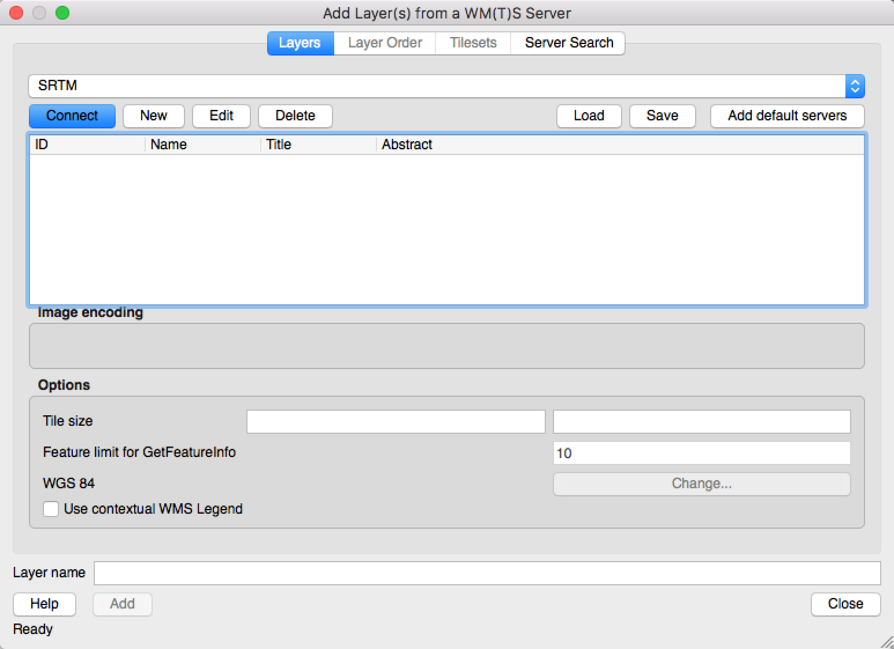
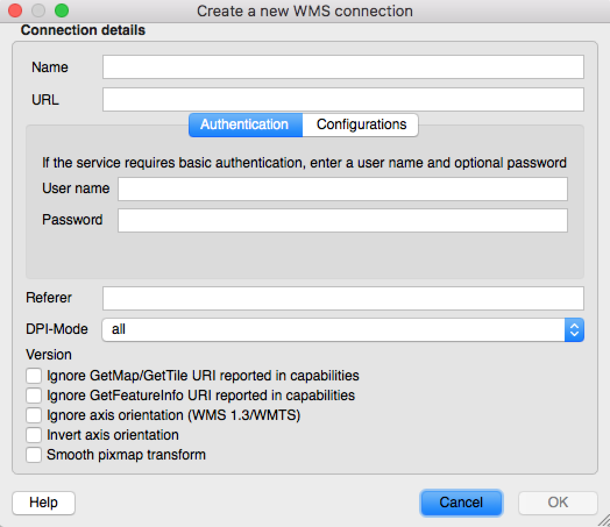
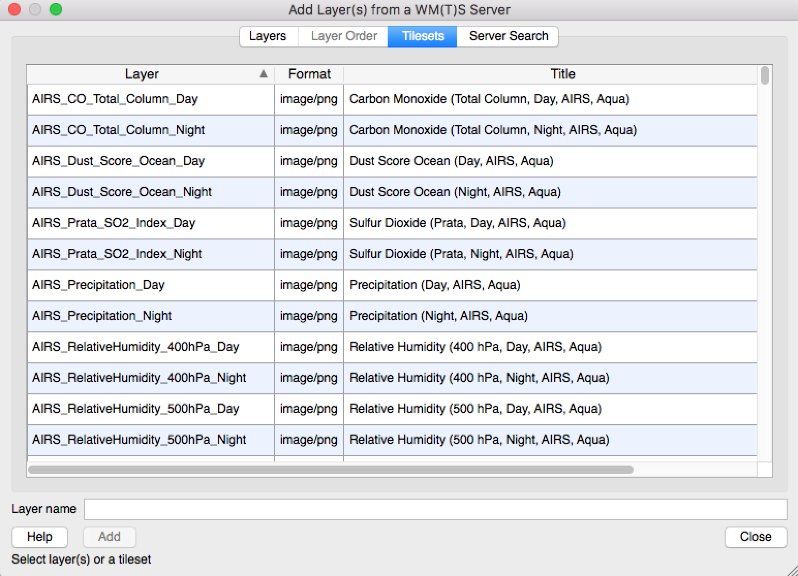

# Adding Imagery Services to QGIS

## Intro
This shows how to add imagery services (WMS) to QGIS.  The example we will be using is NASA's Jet Propulsion Laboratory's Global Imagery Service.

## Instructions
1. Open QGIS
2. Click on the add WMS/WMTS Layer icon (usually on the far left hand column where you add different data types)

3. In the new window that appears click on the New button.

4. In the new window that appears enter what you want to call the service in the ``Name`` field (make sure it is descriptive!)  Next paste the link to the service in the ``URL`` field.  In this example paste: `` https://gibs.earthdata.nasa.gov/wmts/epsg4326/best/wmts.cgi?SERVICE=WMTS&request=GetCapabilities``  There are other fields you may need to fill out for other services but luckily for this one we do not need to.  Next click ``OK``

5. Back at the window in Step 3, click connect on the service you just added.
6. If all went right you should see a list of the available layers as so:

Select the desired layers and click ``Add``.

## List of Imagery/Sensor Services

|Name                       |Free? |url   |
----------------------------|------|------|
|JPL Global Imagery Service | Free | ``https://gibs.earthdata.nasa.gov/wmts/epsg4326/best/wmts.cgi?SERVICE=WMTS&request=GetCapabilities``|
